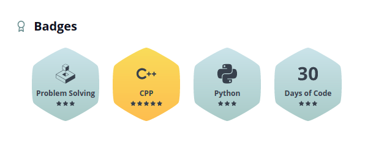

# Hola, Shree here! 👋

  

 
 

- I am fullstack-web developer and graphics designer 🚀
- You can find my projects at https://github.com/WildChildx?tab=repositories
- Looking for internships.
- Can reach me at shreeameyc@gmail.com
- Love to play valorant in free time :D

 
 

# Connect with me

 

 
 

# Tech & Tooling 🛠

 
 

</a>

 
 

# Hackerrank

# Profile Stats

